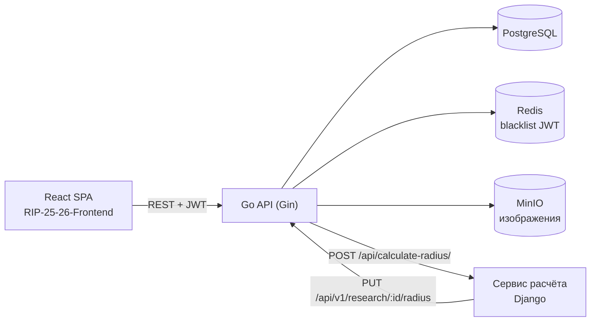
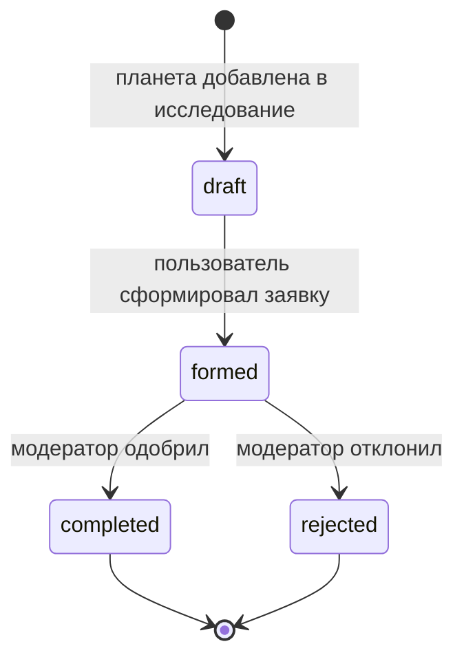

# Exoplanet Radius API

[](https://github.com/dima040805/RIP-25-26/actions/workflows/ci.yml)


REST API для расчёта радиуса экзопланет по падению блеска звезды во время транзита.
Пользователь собирает исследование из планет каталога, указывает для каждой падение
блеска и отправляет заявку. Модератор её одобряет, после чего радиусы считаются
асинхронно в отдельном сервисе.

Проект сделан в курсе «Разработка интернет-приложений» (МГТУ им. Н. Э. Баумана, ИУ5, 2025).

## Возможности

- Каталог экзопланет: поиск по названию, CRUD для модератора, загрузка изображений в MinIO (S3).
- Исследования со статусами `draft → formed → completed | rejected`; удалённые помечаются `deleted`.
- Регистрация и вход по JWT (HS256), роли «пользователь» и «модератор».
- Выход из аккаунта через blacklist токенов в Redis: ключ — SHA-256 токена, TTL — до истечения токена.
- Асинхронный расчёт: после одобрения API отправляет каждую планету в сервис расчёта и принимает результат обратно.
- Swagger UI, миграции схемы через GORM, запуск окружения одной командой.

## Архитектура





Радиус планеты: `R_p = R_star · √(ΔF / 100)`, где `ΔF` — падение блеска в процентах (0–7 %).

## API

Базовый путь `/api/v1`. Полное описание — в Swagger: `http://localhost:8080/swagger/index.html`.

| Метод | Путь | Доступ | Назначение |
|---|---|---|---|
| POST | `/users/sign-up` | все | регистрация |
| POST | `/users/sign-in` | все | вход, выдаёт JWT |
| GET | `/planets` | все | каталог с поиском |
| GET | `/planet/:id` | все | карточка планеты |
| GET | `/research/research-cart` | все | черновик текущего пользователя |
| POST | `/planet/create-planet` | авторизованные | создать планету |
| PUT | `/planet/:id/change-planet` | авторизованные | изменить планету |
| DELETE | `/planet/:id/delete-planet` | авторизованные | удалить планету |
| POST | `/planet/:id/create-image` | авторизованные | загрузить изображение |
| POST | `/planet/:id/add-to-research` | авторизованные | добавить планету в черновик |
| GET | `/researches` | авторизованные | список исследований с фильтрами |
| GET | `/research/:id` | авторизованные | исследование с планетами |
| PUT | `/research/:id/change-research` | авторизованные | изменить исследование |
| PUT | `/research/:id/form` | авторизованные | сформировать заявку |
| DELETE | `/research/:id/delete-research` | авторизованные | удалить исследование |
| PUT / DELETE | `/planets_research/:planet_id/:research_id` | авторизованные | изменить или убрать планету из исследования |
| GET / PUT | `/users/:login/profile` | авторизованные | профиль |
| POST | `/users/sign-out` | авторизованные | выход (токен в blacklist) |
| PUT | `/research/:id/finish` | модератор | одобрить или отклонить |
| PUT | `/research/:id/radius` | сервис расчёта | записать рассчитанный радиус |

## Запуск

### Docker Compose

```bash
docker compose up --build
```

- API: http://localhost:8080/api/v1
- Swagger: http://localhost:8080/swagger/index.html
- Консоль MinIO: http://localhost:9001 (`minioadmin` / `minioadmin`)

Compose поднимает PostgreSQL, Redis, MinIO (с бакетом `test`), применяет миграции и
запускает API. Сервис расчёта запускается отдельно из
[RIP-25-26---async](https://github.com/dima040805/RIP-25-26---async) на порту 8000.

### Локально

```bash
cp .env.example .env
docker compose up -d postgres redis minio minio-init
make migrate
make run
```

## Тесты

```bash
make test   # go test -race ./...
```

Покрыты расчёт радиуса, хеширование паролей, выпуск JWT, разбор заголовка
`Authorization`, CORS, отказ в доступе без токена и с чужой подписью, TTL токена для blacklist.

## Структура

```
cmd/
  PlanetsRadiusResearch/   точка входа API
  migrate/                 миграции схемы (GORM AutoMigrate)
internal/
  app/handler/             HTTP-хендлеры, JWT- и CORS-middleware
  app/repository/          работа с PostgreSQL, Redis, MinIO; бизнес-правила
  app/ds/                  модели БД
  app/api_types/           DTO запросов и ответов
  app/config/, app/dsn/    конфигурация
  pkg/                     сборка приложения
docs/                      Swagger (swag)
resources/                 статические изображения
```

## Связанные репозитории

- Фронтенд: [RIP-25-26-Frontend](https://github.com/dima040805/RIP-25-26-Frontend), демо на [GitHub Pages](https://dima040805.github.io/RIP-25-26-Frontend/)
- Сервис асинхронного расчёта: [RIP-25-26---async](https://github.com/dima040805/RIP-25-26---async)

Этапы курса сохранены в ветках `ssr_imMemory`, `ssr_inDb`, `SPA_backend`, `SPA_backend_swagger`, `async`.
